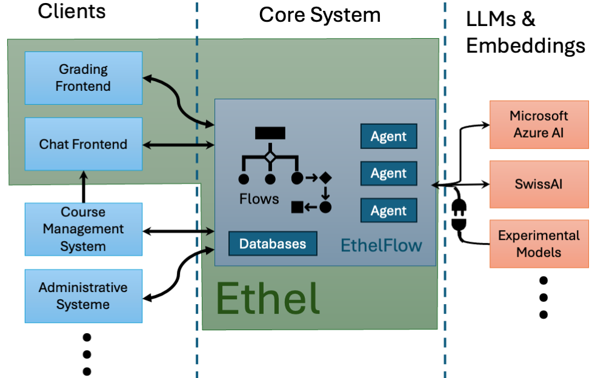
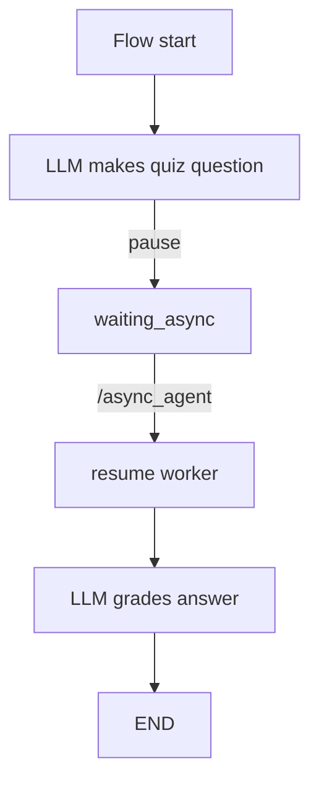

# Project Ethel — *EthelFlow*
Light‑weight, flow–oriented orchestration for AI‑driven grading & chat
back‑ends.  
Part of the **Ethel** ecosystem:

```
┌──────────┐     ┌──────────┐     ┌───────────────────┐
│EthelApp  │ ──► │EthelFlow │ ──► │LLMs, Embeddings…  │
└──────────┘     └──────────┘     └───────────────────┘
      ▲                │
      │  binaries ↑    │  assets↓
      └───────── MongoDB/GridFS
```



---

## Quick links
1. **[Getting Started](#getting-started)**
2. **[HTTP API](#flow-manager-api)**
3. **[Asynchronous “human‑in‑the‑loop” flows](#async-checkpoints)**
4. **[Flows & Agents](#flows-and-agents)**
5. **[Docker / Deployment](#docker--deployment)**
6. **[Extending EthelFlow](#extending-ethelflow)**
7. **[License](#license)**

---

## Getting Started
```bash
git clone https://github.com/<you>/ethelflow
cd ethelflow

# Python dependencies (dev):
pip install -r flow_manager/requirements.txt

# Build & run the complete stack (Flow‑Manager + agents + Mongo)
docker compose up --build
```

*Requires Docker ≥ 24 and Compose v2.*

---

## Flow‑Manager API
### Core endpoints
| Method / Path | Purpose |
|---------------|---------|
| `POST /` | **Invoke a flow** |
| `POST /upload` | Upload any binary to GridFS |
| `GET  /files/*` | List & download assets |
| `POST /async_agent` | Callback from a human or other async agent |
| `GET  /run/<run_id>` | Fetch a paused / finished run document |

### Invoke a flow
```jsonc
POST /
{
  "flow"       : "your_flow_name",
  "context"    : { },        // opaque user/session context
  "query"      : { },        // flow‑specific params
  "file_id"    : "…",        // optional convenience field
  "stream"     : false,      // chunked if true
  "flow_reload": false       // hot‑reload *.py in /flows (dev only)
}
```

* **Non‑stream** → single JSON with the final state  
* **Stream**     → `Transfer‑Encoding: chunked`, one JSON per node update

---

## Asset management
* All user files live in **MongoDB GridFS**.  
* Paths are hierarchical: `collection / dir1 / dir2 / file.ext`.

### Upload
```bash
curl -F "file=@slides.pdf" \
     -F "collection=course123" \
     -F "path=lectures/week1/slides.pdf" \
     https://host/upload
```

### Browse / download
```
GET /files
GET /files/course123
GET /files/course123/lectures/week1/slides.pdf
```

---

## Async checkpoints
Long‑running or human‑driven steps use the built‑in **pause / resume**
mechanism.



1. Flow yields  
   ```json
   {"pause":true,
    "run_id":"…",
    "task_id":"…",
    "question":"…"}
   ```
2. Client shows the question; user responds.  
3. Front‑end calls
   ```json
   POST /async_agent
   {"run_id":"…","result":{"answer":"42"}}
   ```
4. A background worker reloads the pickled state and continues execution.  
5. When finished the run document (`GET /run/<id>`) contains e.g.
   ```json
   { "status":"done", "feedback":{…} }
   ```

No thread or container is blocked while waiting—only a Mongo document
remains.

---

## Flows **and** Agents
### Agents
* Live in `agent_pool/agents/<name>/`  
* Each provides:
  * **`agent.py`** – tiny HTTP server (`/` POST)  
  * **`node_adapter.py`** – client stub imported by flows  

A growing library:

| Category | Agents (`agent_pool/agents`) |
|----------|-----------------------------|
| Embeddings | `emb_ada3large`, `emb_similarity_ada3large` |
| File I/O  | `file_to_text` |
| Language  | `reasoning_completion` |
| Programmatic | `python_processor`, `r_processor`, `maxima_processor` |

### Flows
* Located in `flow_manager/flows/`  
* Built with **LangGraph** `StateGraph`  
* Pattern:

```python
class MyState(TypedDict, total=False): ...
def run(context=None, query=None, file_id=None, stream=False):
    state = MyState(context=context, query=query, stream=stream)
    builder = StateGraph(MyState)
    # add nodes / edges …
    yield from run_flow(builder.compile(), state, stream)
```

`flow_helper.py` provides `linear()` and `run_flow()` helpers to reduce
boilerplate.

---

## Docker / Deployment
```bash
docker compose up --build          # dev stack
docker compose -f prod.yml up -d   # production (traefik, redis, etc.)
```

### Security highlights
* Each programmatic agent launches **ephemeral sandbox containers**
  (`--read-only --net=none --cap-drop=ALL`) per request.  
* Flow‑Manager and agent images run as UID/GID 1000 (non‑root).  
* Only Mongo & Docker socket are mounted where strictly required.

---

## Extending EthelFlow
1. `cookiecutter agent_template` → new micro‑service  
2. Add its adapter to `flows/nodes.py`  
3. `docker compose build <agent>`  
4. Develop a new flow → `flow_reload:true` hot‑reloads code.  
5. Write integration tests in `flow_manager/tests`.

---

## License
Project Ethel, Flow‑Manager component

```
© 2025 ETH Zurich – Gerd Kortemeyer  
GPL‑3.0‑or‑later – see LICENSE or https://www.gnu.org/licenses/gpl-3.0.html
```
