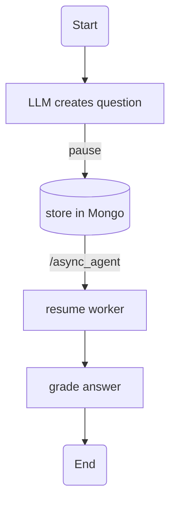

# Project Ethel — *EthelFlow*
Light‑weight, **flow‑oriented** orchestration for AI‑driven grading, chat and reasoning back‑ends.  
Part of the **Ethel** micro‑service ecosystem:

```
┌──────────┐     ┌──────────┐     ┌───────────────────┐
│EthelApp  │ ──► │EthelFlow │ ──► │LLMs, Embeddings…  │
└──────────┘     └──────────┘     └───────────────────┘
      ▲
      │  binaries ↑
      │  vectors  │
      └──► EthelCore  (assets + access‑control)
```

---

## Quick links
1. **[Getting Started](#getting-started)**
2. **[Flow‑Manager HTTP API](#flow-manager-api)**
3. **[Async checkpoints](#async-checkpoints)**
4. **[Flows & Agents](#flows-and-agents)**
5. **[Docker / Deployment](#docker--deployment)**
6. **[Extending EthelFlow](#extending-ethelflow)**
7. **[License](#license)**

---

## Getting Started
```bash
git clone https://gitlab.ethz.ch/ethel/ethelflow.git
cd ethelflow

# Dev dependencies
pip install -r flow_manager/requirements.txt

# Complete dev‑stack (Flow‑Manager + agents)
docker compose up --build
```
*Docker ≥ 24 & Compose v2 required.*

---

## Flow‑Manager API
All requests **must** include `"tenant":"…"` (multi‑tenant isolation).

| Method / Path | Purpose |
|---------------|---------|
| `POST /` | Run a flow (stream or blocking) |
| `POST /async_agent` | Continue a paused run |
| `GET  /run/<id>` | Fetch paused / finished run state |

> **Assets** (`/upload`, `/files/...`) are now handled by the *EthelCore*
> service on ports **8001 / 8002**.  
> From a flow you reference files via their **file_id**
> `tenant/course/path/to/file.ext`.

### Invoke a flow
```jsonc
POST /
{
  "tenant"     : "ethz",
  "flow"       : "emb_file",
  "context"    : {},          // arbitrary user/session context
  "query"      : {},          // flow‑specific parameters
  "file_id"    : "ethz/phy1234/slides.pdf",
  "stream"     : true,        // chunked response if true
  "flow_reload": false        // dev‑hot‑reload
}
```
* **stream=false** → one JSON with final state  
* **stream=true**  → `Transfer‑Encoding: chunked`, JSON per node update

---

## Async checkpoints
Flows can *pause* while waiting for human input or long‑running jobs.



Nothing blocks in memory – only a document in *EthelCore/Mongo*.

---

## Flows **and** Agents
### Agents
Micro‑services in `agent_pool/agents/<name>/`

| Category | Examples |
|----------|----------|
| Embeddings | `emb_ada3large`, `emb_similarity_ada3large` |
| File I/O  | `file_to_text` |
| Reasoning | `reasoning_completion` |
| Execution | `python_processor`, `r_processor`, `maxima_processor` |

Each folder contains:  

* `agent.py` – tiny HTTP server (`POST /`)  
* `node_adapter.py` – client stub imported by flows

### Flows
Python modules in `flow_manager/flows/`, built with **LangGraph**.

```python
class MyState(TypedDict, total=False): ...
def run(context=None, query=None, file_id=None, stream=False):
    state = MyState(context=context, query=query, stream=stream)
    builder = StateGraph(MyState)

    # add nodes…
    linear(builder, [...])
    yield from run_flow(builder.compile(), state, stream)
```

Helpers `linear()` + `run_flow()` live in `flow_manager/flows/flow_helper.py`.

---

## Docker / Deployment
```bash
docker stack deploy -c docker-compose.yml ethelflow   # Swarm example
```

Security highlights
* Program‑execution agents spawn **sandboxed throw‑away containers**
  (`--read-only --net=none --cap-drop=ALL`).
* Services run as non‑root UID/GID 1000.
* Only the Docker socket and required volumes are mounted.

---

## Extending EthelFlow
1. `cookiecutter agent_template` → new micro‑service  
2. Drop its `node_adapter.py` into `flow_manager/flows/nodes.py`  
3. `docker compose build <agent>`  
4. Develop a new flow (`flow_reload:true` hot‑reloads).  
5. Add integration tests in `flow_manager/tests`.

---

## License
```
© 2025 ETH Zurich – Gerd Kortemeyer
GPL‑3.0‑or‑later – see LICENSE or https://www.gnu.org/licenses/gpl-3.0.html
```
